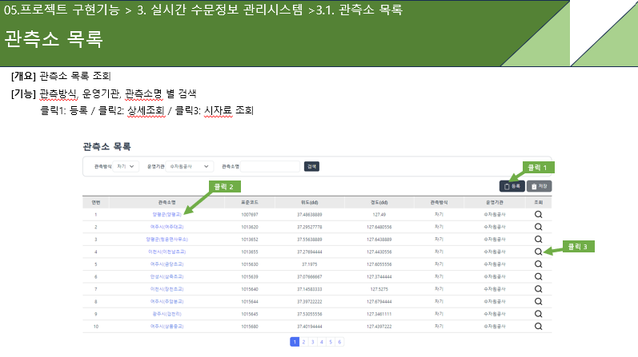
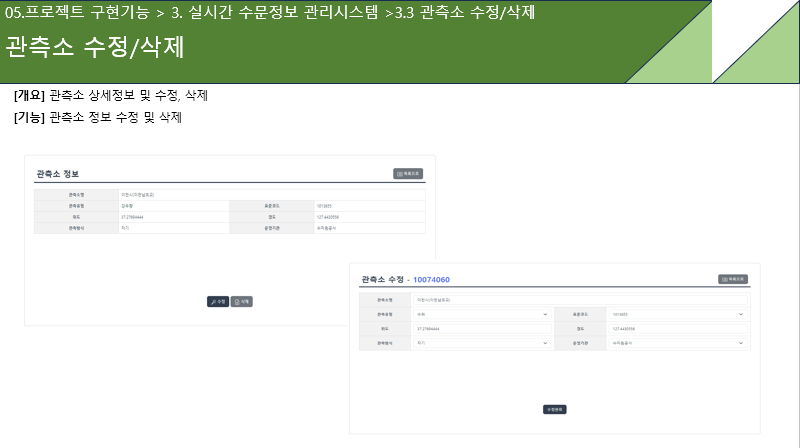
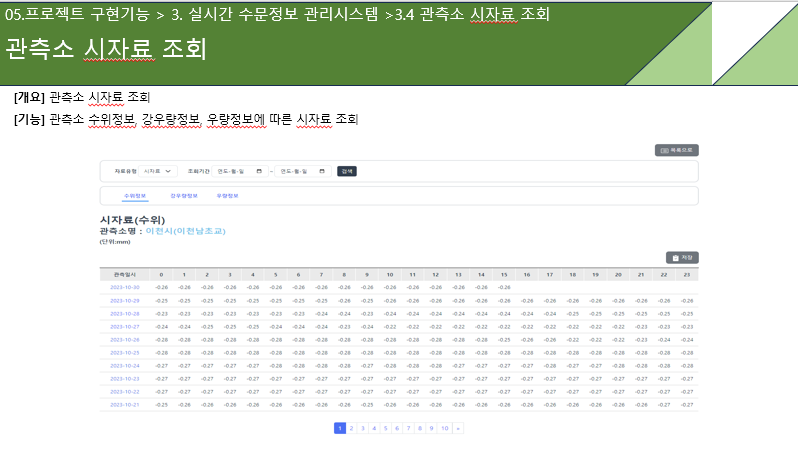
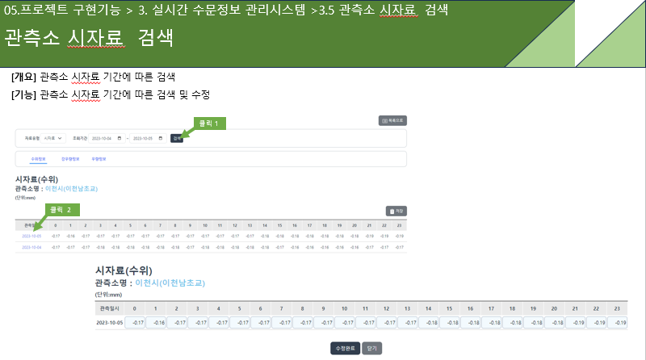
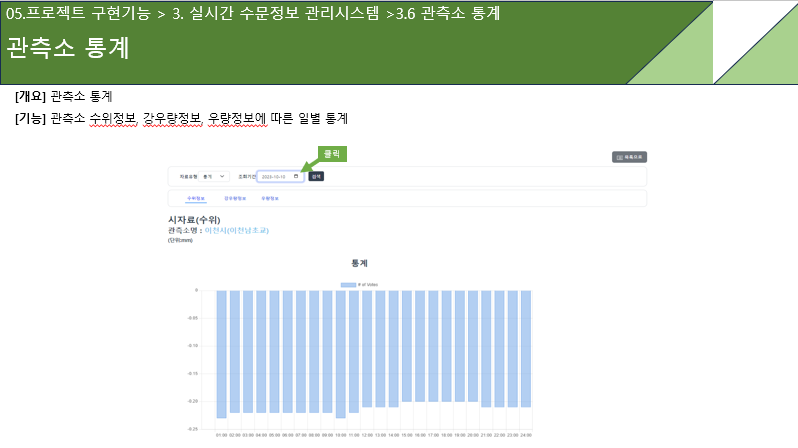

# connection
- 진행 기간 : 2023.12.1 ~ 2023.1.4 (5주간)  
- 프로젝트 명 : 수자원 종합관리 플랫폼

## 팀원 소개
 - 팀장 : 이광현 

 - 팀원 : 강준우, 이진희, 조미혜, 황인정  

## 기술 스택
-  
- 
- 
-  
-     

- 
- 

## 기획배경
 - 수자원 통합 관리 정보 시스템 구축 (수자원 관리 효율성 및 체계 강화)
 - 체계적인 수자원 정보 관리 실현 (다양한 정보를 통합해 관리하는 GIS 기반의 시스템 구축)  

## 프로젝트 소개
 - 한강 유역의 수문을 지도 서비스와 연동하여 관측소 위치 및 시설물을 편리하게 볼 수 있습니다.
 - 수자원 시설물 관리시스템을 통해 점검결과 및 이력 조회, 고장/조치 결과 보고서를 작성 할 수 있습니다.

 
### 프로젝트 프로세스
 - 관리자 시스템 : 사용자, 운영, 시스템 관리
 - 실시간 수문 정보 : 지도 (관측소, 시설물, 레이어, 북마크), 목록(관측소, 수자원등의 조회, 등록, 수정, 삭제)
 - 수자원 시설물관리 시스템 : 점검이력결과 작성, 조회, 통계 및 고장/조치 보고서

 
## 나의 구현 기능

 ### 관측소 목록 조회 및 등록, 수정, 삭제

  - 관측방식, 운영기관, 관측소명 별 검색
  
   
  
 ### 관측소 시자료 조회

  - 수위정보, 강우량 정보, 우량정보에 따른 시자료 조회
  
  
 ### 시자료 검색

  - 관측소 시자료 기간에 따른 검색 및 수정
  
  
 ### 시자료 통계

 - Ajax + Chart.js 을 활용하여 수위정보, 강우량 정보, 우량정보에 따른 일별 통계 확인
 
  
  
## 프로젝트 소감
팀원 개개인이 자기가 맡은 부분을 성실히 해내어 어느정도 완성도 있는 결과를 
산출해 낸 것 같습니다. 이전까지 배웠던 내용을 어떻게 활용하는지 막연했는데 프로젝트를 
통해 전자정부 프레임워크와 지도 등을 활용하여 실무에 한걸음 다가가게 되었던 것 같습니다. 특히 통계부분은 다뤄보지 못한 부분이었는데 이번 기회를 통해 차트 API를 활용하는 방법을 알게 되어 뜻깊은 경험이었던 것 같습니다.)https://github.com/rhkd4129/sundo_project_23501a
https://github.com/rhkd4129/sundo_project_23501a.gith# connection

- 진행 기간 : 2023.12.1 ~ 2023.1.4 (5주간)  
- 프로젝트 명 : 수자원 종합관리 플랫폼

## 팀원 소개
 - 팀장 : 이광현 

 - 팀원 : 강준우, 이진희, 조미혜, 황인정  

## 기술 스택
-  
- 
- 
-  
-     

- 
- 

## 기획배경
 - 수자원 통합 관리 정보 시스템 구축 (수자원 관리 효율성 및 체계 강화)
 - 체계적인 수자원 정보 관리 실현 (다양한 정보를 통합해 관리하는 GIS 기반의 시스템 구축)  

## 프로젝트 소개
 - 한강 유역의 수문을 지도 서비스와 연동하여 관측소 위치 및 시설물을 편리하게 볼 수 있습니다.
 - 수자원 시설물 관리시스템을 통해 점검결과 및 이력 조회, 고장/조치 결과 보고서를 작성 할 수 있습니다.

 
### 프로젝트 프로세스
 - 관리자 시스템 : 사용자, 운영, 시스템 관리
 - 실시간 수문 정보 : 지도 (관측소, 시설물, 레이어, 북마크), 목록(관측소, 수자원등의 조회, 등록, 수정, 삭제)
 - 수자원 시설물관리 시스템 : 점검이력결과 작성, 조회, 통계 및 고장/조치 보고서

 
## 나의 구현 기능

 ### 관측소 목록 조회 및 등록, 수정, 삭제

  - 관측방식, 운영기관, 관측소명 별 검색
  
   
  
 ### 관측소 시자료 조회

  - 수위정보, 강우량 정보, 우량정보에 따른 시자료 조회
  
  
 ### 시자료 검색

  - 관측소 시자료 기간에 따른 검색 및 수정
  
  
 ### 시자료 통계

 - Ajax + Chart.js 을 활용하여 수위정보, 강우량 정보, 우량정보에 따른 일별 통계 확인
 
  
  
## 프로젝트 소감
팀원 개개인이 자기가 맡은 부분을 성실히 해내어 어느정도 완성도 있는 결과를 
산출해 낸 것 같습니다. 이전까지 배웠던 내용을 어떻게 활용하는지 막연했는데 프로젝트를 
통해 전자정부 프레임워크와 지도 등을 활용하여 실무에 한걸음 다가가게 되었던 것 같습니다. 특히 통계부분은 다뤄보지 못한 부분이었는데 이번 기회를 통해 차트 API를 활용하는 방법을 알게 되어 뜻깊은 경험이었던 것 같습니다.
