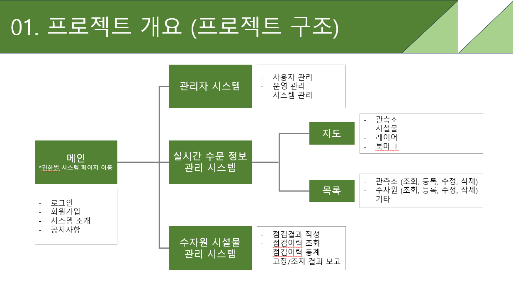

# connection

- 진행 기간 : 2023.12.1 ~ 2023.1.4 (5주간)  
- 프로젝트 명 : 수자원 종합관리 플랫폼

## 팀원 소개
 - 팀장 : 이광현 

 - 팀원 : 강준우, 이진희, 조미혜, 황인정  

## 기술 스택
-  
- 
- 
-  
-     

- 
- 

## 기획배경
 - 수자원 통합 관리 정보 시스템 구축 (수자원 관리 효율성 및 체계 강화)
 - 체계적인 수자원 정보 관리 실현 (다양한 정보를 통합해 관리하는 GIS 기반의 시스템 구축)  

## 프로젝트 소개
 - 한강 유역의 수문을 지도 서비스와 연동하여 관측소 위치 및 시설물을 편리하게 볼 수 있습니다.
 - 수자원 시설물 관리시스템을 통해 점검결과 및 이력 조회, 고장/조치 결과 보고서를 작성 할 수 있습니다.

 
### 프로젝트 프로세스
 - 관리자 시스템 : 사용자, 운영, 시스템 관리
 - 실시간 수문 정보 : 지도 (관측소, 시설물, 레이어, 북마크), 목록(관측소, 수자원등의 조회, 등록, 수정, 삭제)
 - 수자원 시설물관리 시스템 : 점검이력결과 작성, 조회, 통계 및 고장/조치 보고서

### 주요 기능
 - 지도
 - 
  
  
 
## 나의 구현 기능

 ### 프로젝트 생성

  - 프로젝트 팀장의 반 학생들을 목록화하여 선택할 수 있습니다.
  
   
  
 ### 프로젝트 단계 프로파일

  
  
   

   - 프로젝트 승인시 단계가 자동으로 생성되며 추가 및 삭제 가능하고 프로젝트 단계를 설정 할 수 있습니다.
  
  
  
 ### 프로젝트 승인

  - 프로젝트 승인 시 멤버, 프로젝트 번호를 순차적으로 동시에 진행하며 프로세스 단계를 생성하게 됩니다.
  - 프로젝트 삭제 시 프로젝트 번호, 멤버를 순차적으로 동시에 진행하여 프로세스를 삭제하게 됩니다. 

  
  
  
 ### 통합검색

  
  
   
  
## 프로젝트 소감
학원에서 배운 내용을 어떻게 실제상황에서 접할지 막막했었습니다.
이번 프로젝트의 가장 어려웠던 점은 어떤 프로세스를 토대로 프로그램을 만들어야 될지 많이 고민 했었습니다.
또한 여러 작업을 동시다발적으로 한번에 진행해야되서 서로 고민이 많았던것 같습니다.
팀장의 역할을 맡아 어깨가 무거웠지만 팀원들의 도움으로 서로 의견을 내고 도와주면서 잘 마무리 지었고 개발자로서 한걸음 다가갈수 있는 기회가 되었습니다.
